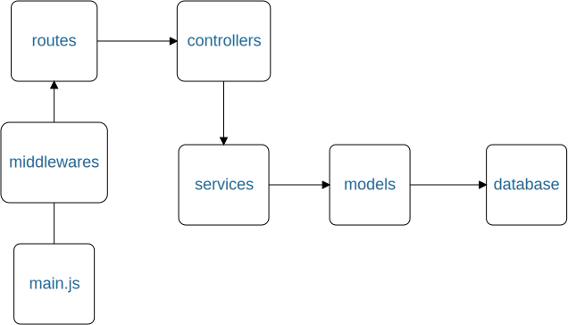

# Application

## Arborescence de l'application

```sh
.
├── controllers
│   ├── index.js
│   └── user.js
├── docker-compose.yml
├── main.js
├── middlewares
│   ├── auth-token.js
│   └── jwt-middleware.js
├── models
│   ├── menu-model.js
│   └── user-model.js
├── routes
│   ├── index.js
│   └── user.js
├── services
│   ├── menu-service.js
│   └── user-service.js
└── utils
    ├── bcrypt-password.js
    └── jwt.js
```

# Schema de l'application



# Créer une page

- Ajoutez un controller dans le répertoire controller
- Associez la route avec le controller dans le répertoire route
- Créez un model de données dans le répertoire models
- Créez un service pour manipuler le model de données dans le répertoire service

## Base de données

**! Attention !** Par défaut les mots de passe sont stockés en clair dans la base de données. 
Avec l'application nodejs les mots sont hashés.